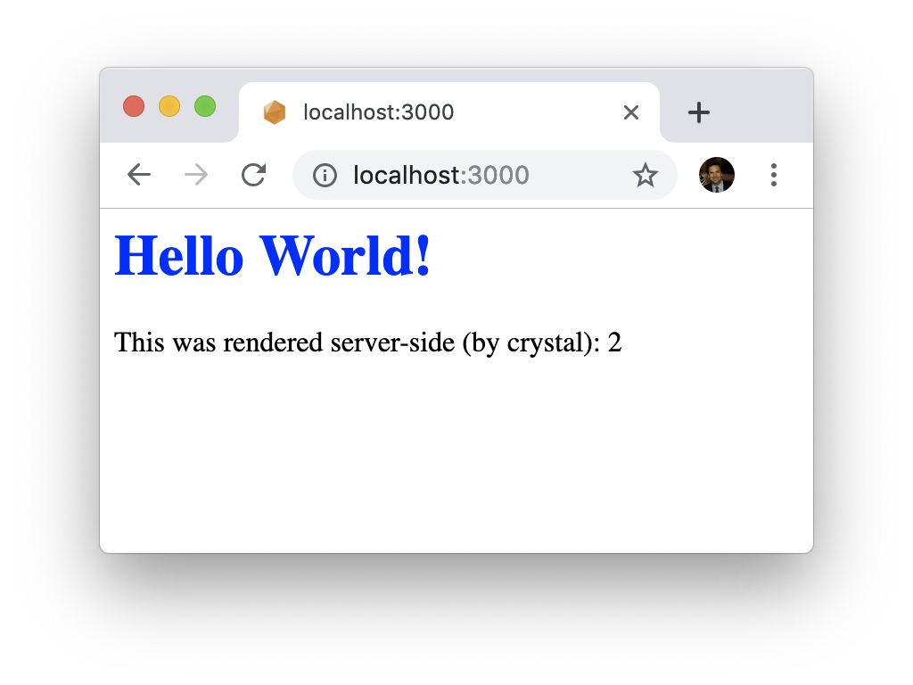
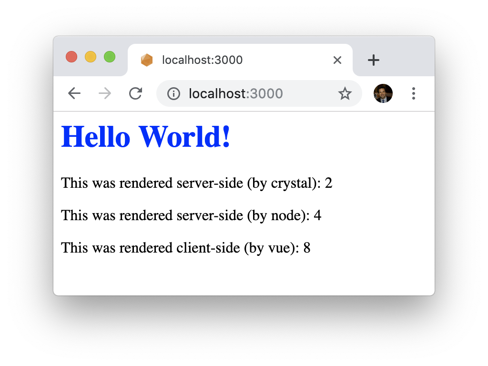
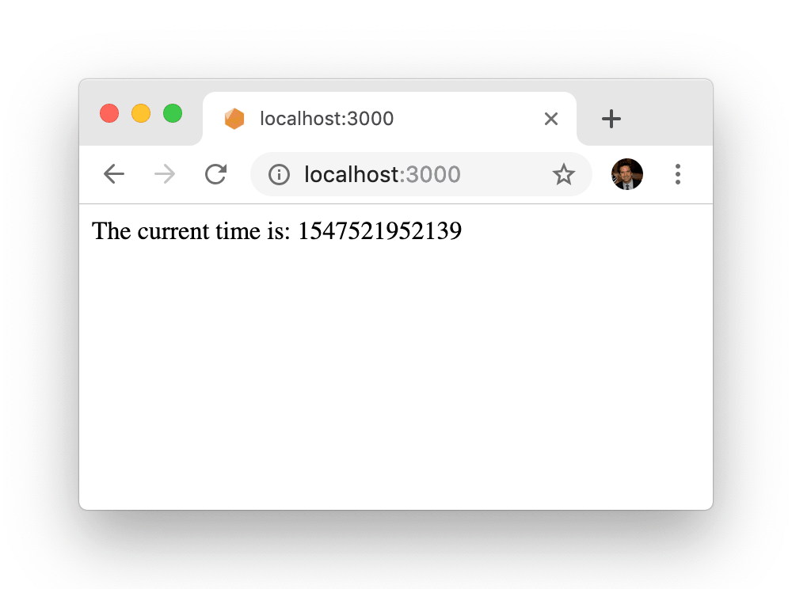

# crystal-vue

 Crystal +  Vue.js = :zap:

## Introduction

Crystal-vue allows you to use the full power of [Vue.js](https://vuejs.org/) components in your [Crystal](https://crystal-lang.org) web apps.  It's a drop-in replacement for your view layer -- no more need for intermediate `.ecr` templates.  With crystal-vue, you write your backend server code in Crystal, your frontend client code in JavaScript & HTML, and everything works together seamlessly...and fast.

Pages are delivered to the client fully-rendered and SEO-friendly (like a traditional web app), but with the power and reactivity of Vue taking over once the page has loaded.

This means you get the best of all worlds -- clients see lightning fast page loads (since the initial payload is pure HTML/CSS) yet still get the benefit of rich dynamic JavaScript-enabled components the load without stutters or flickers.

And your job as a developer is easier:  Instead of writing an intermediate view layer (typically `.ecr` or similar templates) which glues your server code & client code together, you write pure Vue components **once** with all your server-side data seamlessly blended in.  Awesome, right?  

## Features

  * (`.vue`) SFC (single-file component) support
  * Server-side rendering w/ variables interpolated in Crystal and/or JavaScript
  * Client-side hydration for full-featured reactive pages
  * Configurable layouts/templates
  * Built-in support for [Amber](https://amberframework.org) (other frameworks coming soon)

## Background

Traditional web apps were mostly server-powered -- a client (browser) would make a request, the server would do some processing, render the page, and send down HTML, CSS, and maybe a little JavaScript to spice things up.  Pages loaded lightning fast and SEO was simple (crawlers saw basically the same thing as users).

With the advent of powerful JavaScript frameworks like Vue, much of the work shifted to the client.  The server became a vessel for a client-loaded JavaScript bundle (and an API endpoint to communicate with that client) and your browser rendered most of what you'd see on the page via JavaScript.  Web apps certainly became more powerful and dynamic (the notion of a Single Page App was born), but at the cost of higher initial load time, worse SEO (crawlers saw basically nothing since all the logic lived in JavaScript), and increased complexity (you now had to manage two view layers).

Both React and Vue added Server Side Rendering support to mitigate this, but both have that support baked solely into Node (since it's JavaScript all the way down.)

Crystal is awesome and a joy to use for server-side web processing.  Vue is awesome and a joy to use for client-side reactivity and UI composability.  Crystal-vue now lets you bring those joys together.  This is ideal for folks who believe the heavy lifting of page rendering should (mostly) be done by the server and yet still want the reactivity and dynamism of a powerful client-side framework like Vue.

#### THIS IS PREVIEW / EARLY ALPHA SOFTWARE

**This is not much more than a proof-of-concept at the moment, but it does work!  Standard warnings apply - it will likely break/crash in spectacular and ill-timed glory, so don't poke it, feed it past midnight, or use it for anything mission-critical (yet).**

## Show Me The Money

Start with a regular 'ol Amber controller & `.ecr` template

````crystal
# home_controller.cr

class HomeController < ApplicationController
  def index
    example_crystal_data = 1 + 1
    render("index.ecr")
  end
end
````

````crystal
# index.ecr

<div>
  <h1>Hello World!</h1>
  <p>This was rendered server-side (by crystal): <%= example_crystal_data %></p>
</div>
````

`example_crystal_data` is simple arithmetic here, but imagine it's a database query in a more complex application).  In this simple example, the basic `.ecr` template works perfectly.

If you want to add some client-side reactivity and, say, a Vue component, things get more complex.  You'll have to split up your view logic between this `.ecr` file (which becomes rendered HTML) and the Vue component (which doesn't get rendered until the client finishes loading), pass in `example_crystal_data` via props, load it via a backchannel API call, or use some other series of intermediate glue steps.

Why not skip all of that and make the data available directly in the Vue component?  Replace the `render` call with our new `vue_render` macro and move our server-side calculation into a special `@vue_context` object:

````crystal
# home_controller.cr - crystal-vue powered

class HomeController < ApplicationController
  def index
    @vue_context[:example_crystal_data] = 1 + 1
    vue_render(@vue_context)
  end
end
````

Now instead of a server-rendered `.ecr` template + client-rendered Vue component, you skip the `.ecr` step entirely and put all of your view code (including CSS) into a single Vue component that's both server- and client-rendered:

````vue
// Index.vue

<template>
  <div>
    <h1>Hello World!</h1>
    <p>This was rendered server-side (by crystal): {{ example_crystal_data }}</p>
  </div>
</template>

<script>
module.exports = {
  computed: {
    example_crystal_data() {
      return this.$store.state.crystal.example_crystal_data
    }
}
</script>

<style scoped>
h1 {
  color: blue;
}
</style>
````

Et voila:



Ok that's not so exciting.  And it's a bit more verbose.  But there's more to this, I promise!  The key is that number 2 is not just a static ASCII character loaded via HTML -- it's actually a fully reactive element of a live Vue component:


A quick peek at the raw HTML shows our server's doing all the hard work (which is what servers were designed to do) and sending us a fully rendered page that, even if it were more complex, would load quickly and be SEO-friendly:

````html
❯ curl localhost:3000

<html>
  <head>
    <link rel="preload" href="/dist/cvue.main.js" as="script">
    <style data-vue-ssr-id="ba041780:0">
    h1[data-v-5e7337c8] {
      color: blue;
    }
    </style>
  </head>
  <body>
    <div id="crystal-vue-app" data-server-rendered="true">
      <div data-v-5e7337c8>
        <h1 data-v-5e7337c8>Hello World!</h1>
        <p data-v-5e7337c8>This was rendered server-side (by crystal): 2</p>
      </div>
    </div>
    <script src="/dist/cvue.main.js" defer></script>
  </body>
</html>
````

There's a lot going on in there and we'll get into more detail later, but in short: Crystal-vue is taking the result of the server-side calculation (1 + 1), rendering the HTML, inserting a default layout, injecting the relevant CSS (scoped to this component), and compiling & linking to a client-side JS bundle. 

### Data Computation Options

Crystal-vue gives you flexibility in where your data computation is done - on the server (in Crystal), on the server (in Node/JavaScript), or on the client (in Vue/JavaScript).  It totally depends on the needs of your application, and you can mix-and-match.

#### 1) Server-side:  Crystal

Our first example did the "work" (calculating 1 + 1) server-side, in crystal.  Let's look at the other options...

#### 2) Server-side:  JavaScript

Because Crystal-vue uses a live [NodeJS](https://nodejs.org/en/) process behind the scenes, you can choose to do computations in that context.  This gives you access to the whole ecosystem of Node modules to use in your application as-needed.

Changing our Vue component slightly:

````vue
  // Index.vue

  <template>
    <div>
      <h1>Hello World!</h1>
      <p>This was rendered server-side (by crystal): {{ example_crystal_data }}</p>
+     <p>This was rendered server-side (by node): {{ example_node_data }}</p>
    </div>
  </template>

  <script>
  module.exports = {
    computed: {
      example_crystal_data() {
        return this.$store.state.crystal.example_crystal_data
      }
    },
+   data() {
+     return {
+      example_node_data: 2 + 2
+     }
+   },
  }
  </script>

...

````

Gives us, as expected:


And again, this is all being done server-side, the raw HTML tells the same story:

````html
❯ curl localhost:3000

...

<div data-v-5e7337c8>
  <h1 data-v-5e7337c8>Hello World!</h1>
  <p data-v-5e7337c8>This was rendered server-side (by crystal): 2</p>
  <p data-v-5e7337c8>This was rendered server-side (by node): 4</p>
</div>

...

````

#### 3) Client-side:  JavaScript

Thus far we haven't actually done any client-side DOM manipulation even though we're using a client-side reactive framework.  Ironic, right?

Of course you can have crystal-vue do pure client rendering if you want.  We do this by taking advantage of how Vue component lifecycles work (the `mounted()` hook is not called when doing SSR, only on the client).  

Let's modify our Vue template once more:

````vue
  <template>
    <div>
      <h1>Hello World!</h1>
      <p>This was rendered server-side (by crystal): {{ example_crystal_data }}</p>
      <p>This was rendered server-side (by node): {{ example_node_data }}</p>
+     <p>{{ example_client_data }}</p>
    </div>
  </template>

  <script>
  module.exports = {
    computed: {
      example_crystal_data() {
        return this.$store.state.crystal.example_crystal_data
      }
    },
    data() {
      return {
        example_node_data: 2 + 2,
+       example_client_data: null
      }
    },
+   mounted() {
+     this.example_client_data = `This was rendered client-side (by vue): ${4 + 4}`
+   }
  }
</script>

...
````

And we see:



All looking good.  Same with the raw HTML:

````html
❯ curl localhost:3000

...

<div data-v-5e7337c8>
  <h1 data-v-5e7337c8>Hello World!</h1>
  <p data-v-5e7337c8>This was rendered server-side (by crystal): 2</p>
  <p data-v-5e7337c8>This was rendered server-side (by node): 4</p>
  <p data-v-5e7337c8></p>
</div>

...
````

Note our most recent addition is not being rendered on the server, as it should(n't).

#### Server rendering + Client-side hydration

Let's make this more interesting:  We want to actually have some fun, live, dynamic stuff happen on the client (which is why we're using a framework like Vue in the first place, right?)

Crystal-vue's hybrid rendering model that we saw in the first example (which exposes the power of both server- and client-side rendering) is called client-side hydration, and it's awesome.

Our fun, live, dynamic stuff is going to be a....clock.  Ok fine I'll come up with a better example later.  But for now it's simple and shows off the concept.

Our new Vue component:

````vue
<template>
  <div>
    <p>The current time is: {{ current_time }}</p>
  </div>
</template>

<script>
module.exports = {
  data() {
    return {
      current_time: Date.now()
    }
  },
  methods: {
    setCurrentTime() {
      this.current_time = Date.now()
    }
  },
  mounted() {
    setInterval(this.setCurrentTime, 100)
  }
}
</script>
````

Translating this to English, we are:

* defining a reactive data element in `data()` called `current_time` that gets an initial value of `Date.now()`
* defining a method called `setCurrentTime()` that sets `current_time` to be `Date.now()` when called, and
* using the `mounted()` lifecycle hook to call `setCurrentTime()` every 100 ms when the component is mounted (client-only)

When a request comes in, the server will render the component and send down the following (static) HTML, which represents a snapshot of the current time as of when the request came in:

````html
❯ curl localhost:3000

...

<div>
  <p>The current time is: 1547520952139</p>
</div>

...
````

In your browser, the javascript bundle (along with Vue) will load and automatically understand that this is server-rendered Vue code.  It then "hydrates" the static element and makes it dynamic, as such:



Huzzah!  Server-rendered initial view, reactive (hydrated) elements after load, and a rich dynamic (sort of) UI for the user, and all in a single piece of view code.  Heaven. 

### Requirements

* Crystal 0.27
* Yarn 1.12+
* Node 10+

The render server was built using node 10.15.3 (in particular it uses the WHATWG URL Standard, which was added in Node 7+.)  It doesn't need to do this, strictly-speaking, and if there's a compelling reason to support earlier versions of node I'm happy to make this change.)

## Installation

(Note:  This is a bit more manual than I'd like.  Automation to come.)

Crystal-vue has been developed / tested with the [Amber](https://amberframework.org) web framework, but designed to work standalone as well.  There's also no reason it won't work with [Lucky](https://luckyframework.org/), [Kemal](http://kemalcr.com/), etc. (but no work integrating with those has been done yet.)

**1) Add crystal-vue to your application's `shard.yml` and run `shards install`:**

```yaml
dependencies:
  crystal-vue:
    github: noahlh/crystal-vue
    version: ~> 0.1.0
```

**2) Add `crystal_vue_amber_init.cr` to `/config/initializers`.**  [An example is provided.](/config/crystal_vue_amber_init.example.cr)  You can name this file whatever you want, just so long as it gets called upon initialization.

**3) Add a `routes.js` file to `/config`.**  This should export an array of path/component mappings, for example:

````javascript
// routes.js

export default [
  { path: '/', component: 'home/Index' },
  { path: '/about', component: 'static/About' },
  { path: '/user/:userid', component: 'users/User' },
]
````

This is almost exactly like the routes object you'd use with [vue-router](https://router.vuejs.org/guide/#html) and in fact uses that underneath.  

There is one small difference here, in that with vue-router you're specifying the actual component (that you've `import`'ed).  Here, instead, you'll specify a string with the component name (and subdirectory off the main components folder).

This is annoyingly redundant (since you've already specified your routes w/ controllers & actions in Amber), and also somewhat hard to reason about, so it's going on the chopping block soon and I'll figure out a more elegant solution.

**4) Add a default layout.**  This is the shell HTML into which your Vue components will be injected.  You must include the magic comment `<!--vue-ssr-outlet-->` where you'd like your components injected.

````html
<!-- main.html -->

<html>
  <head>
    ... head ...
  </head>
  <body>
    <!--vue-ssr-outlet-->
  </body>
</html>
````

TODO, high on the list:  Variable interpolation in this layout so you can do dynamic titles, etc.

**5) Include the helper `CrystalVue::Adapter::Amber` in your `application_controller.cr`.**  This adds the `vue_render` macro and sets up the `@vue_context` object.

````crystal
  # application_controller.cr

  require "jasper_helpers"

  class ApplicationController < Amber::Controller::Base
    include JasperHelpers
+   include CrystalVue::Adapter::Amber
  end
````

**6) Add your `.vue` files to your views folder and get building!**

## Usage Details

### `vue_render` macro

`vue_render(vue_context : CrystalVue::Context = nil, path : String? = nil, template : String? = nil)`

Performs the render.  This is to be called where you'd normally call `render` in your controllers.  It doesn't need any parameters by default (it automatically extracts the path of the method calling it based on your Amber routes), but accepts the following optional parameters:

**`vue_context : CrystalVue::Context`** - The Crystal-vue Amber helper creates a special Hash-like object called `@vue_context`.  Any variables you'd like available in your Vue components go in here, using a Symbol key of the desired name.

So if you want to access `example_crystal_data` in your vue component, assign the relevant value to `@vue_context[:example_crystal_data]`.

Behind the scenes, crystal-vue sets up a [Vuex](https://vuex.vuejs.org/) store to be accessed in the Vue component.  The crystal-rendered data (`example_crystal_data`) is automatically injected into that store (under the `crystal` namespace) and is available under `this.$store.state.crystal` in all of your Vue components.  

**`path : String?`** - If you need to manually specify which path you're rending (i.e. you're not in Amber), you can pass in a string parameter.  In Amber this will be assigned a default value equal to the current Amber route the controller method is handling.

**`template : String?`** - Which layout/template you'd like to render the component in.  Uses the default template specified in the init file if none specified on render.

### Why isn't the syntax `vue_render(Index.vue)`?

With `.ecr` templates, you're explicitly rendering a specific template.  Vue SSR doesn't quite work that way -- instead, you render a route, which is composed of a path and a component (this is defined in routes.js).  Since the mapping between a controller's routes & actions is already established, specifically naming the Vue file would be redundant.

This can be slightly confusing, I might consider making it a bit more explicit as this project develops (eliminate the need for a routes.js and build that mapping implicitly by looking at the rendered components in each controller action.)

## Server Client Rendering (Node/JavaScript)

[(From Vue's docs on SSR)](https://ssr.vuejs.org/guide/universal.html)

> Since there are no dynamic updates, of all the lifecycle hooks, only `beforeCreate` and `created` will be called during SSR. This means any code inside other lifecycle hooks such as `beforeMount` or `mounted` will only be executed on the client.

Outside the lifecycle hooks, anything in your `data` object will be rendered both server- and client-side (on initial load).

There are some other considerations to keep in mind when writing components that will be used both on the server and client.  [You can read more about those here.](https://ssr.vuejs.org/guide/universal.html)

### Client-only rendering (Vue/JavaScript)

If you want something rendered _only_ on the client and not in any server context, you can use any lifecycle method other than `beforeCreate` and `created`.  [See the Vue docs for complete details on all lifecycle hooks.](https://vuejs.org/v2/api/#Options-Lifecycle-Hooks)

## How Crystal-vue Works

Crystal-vue launches and manages a local node process ([render-server.js](/src/server/render-server.js)) that runs a very lightweight HTTP server to perform Vue server-side rendering.  The `vue_render` macro simply makes an HTTP call to that node server with any Crystal-computed variables as parameters.

This server closely follows the model outlined in the [Vue SSR Rendering Guide](https://ssr.vuejs.org/) and adds in dynamic component loading and a few bits to handle the interaction with the crystal client.

This is roughly the same architecture that AirBNB's [Hypernova](https://github.com/airbnb/hypernova) uses, and has some of the same tradeoffs.  While there's definitely some overhead in making HTTP requests, it's still extremely fast:  A simple page render from Amber takes about 3ms on a 2015 MBP, including the back-and-forth over HTTP.  This is an order of magnitude slower than a base case Amber render (approx. 300 microseconds).  But it's fast enough for now, though most certainly an area to explore for future optimization.

The node process integrates Webpack (using the node API) to compile the Vue templates and setup the client & server bundles.  In development, it runs `webpack.watch()` and will keep an eye out for changes to your `.vue` components. In a production, it runs `webpack.run()` and does the compilation once.

I've tried to comment the code extensively, but I'm also writing this up in more detail mostly as a high-level reference *ahem* and reminder to myself *cough* about exactly how the various internals work.

### Environment Variables

A few environment variables are set prior to loading the render server.  You shouldn't need to touch any of this as Crystal-vue handles this automatically.

`VUE_COMPONENT_DIR` - **Required** - The directory where the vue components for the project can be found.

`VUE_ROUTES_FILE` - **Required** - The file (in .json format) that contains the mapping between routes and Vue components.

`VUE_TEMPLATE_DIR` - this is used to specify the directory from which to load layouts/templates.  The terminology is a bit confusing - Vue refers to templates (the standalone files) the way that Amber/rails/etc. refer to layouts - a structured HTML document in which to inject the rendered page content.  Layout is probably a better term to use since templates also refer to the HTML portion of an actual Vue component.

`NODE_PORT` - The port on which the render server runs and communicates with the Crystal-vue render client.  This is for internal communications only and defaults to port 4000.

TODO:  Auto-detect if the port is in use and find an open one.  Right now things crash and burn if something is already on port 4000, including another instance of `render-server.js`.

`NODE_ENV` - The environment in which to run the node server (development, test, prod, etc.).  Defaults to 'development'

## Project Status

My goal/philosophy is to release early, release often, and get as much user feedback as early in the process as possible, so even though the perfectionist in me would like to spend another 6 years improving this, by then it'll be 2024 and who knows we might all be living underwater.  No time like the present.

## Roadmap

Short-term goals:

- [x] Release this embarrassing 0.1.0 version
- [ ] Get usage --> expose bugs
- [ ] Fix reloading issues (not everything restarts properly)
- [ ] Figure out Hot Module Reloading (HMR)
- [ ] Automate installation
- [ ] Get example / demo project live
- [ ] Improve error handling
- [ ] Write more comprehensive tests
- [ ] Figure out CSS splitting
- [ ] Add support for preprocessors in .vue files (pug, SCSS, stylus, etc.)

Longer-term goals:

- Performance improvements
- Port to Ruby/Rails
- Remove need for a separate node process / http (evaluate JS in crystal, compile templates without Webpack?)

## Contributions / Critique Wanted!

This has been a solo project of mine and I would love nothing more than to get feedback on the code / improvements / contributions.  I've found by far the best way to learn and level-up development skills is to have others review code that you've wrestled with.  

That is to say, don't hold back.  Report things that are broken, help improve some of the code, or even just fix some typos.  Everyone (at all skill levels) is welcome.

1. Fork it (<https://github.com/noahlh/crystal-vue/fork>)
2. Create your feature/bugfix branch (`git checkout -b omg-this-fixed-so-many-bugs`)
3. Make magic (and don't forget to write tests!)
4. Commit your changes (`git commit -am 'Made '`)
5. Push to the branch (`git push origin omg-this-fixed-so-many-bugs`)
6. Create a new Pull Request
7. ::party::

## Contributors

- Noah Lehmann-Haupt (nlh@nlh.me / [noahlh](https://github.com/noahlh)) - creator, maintainer